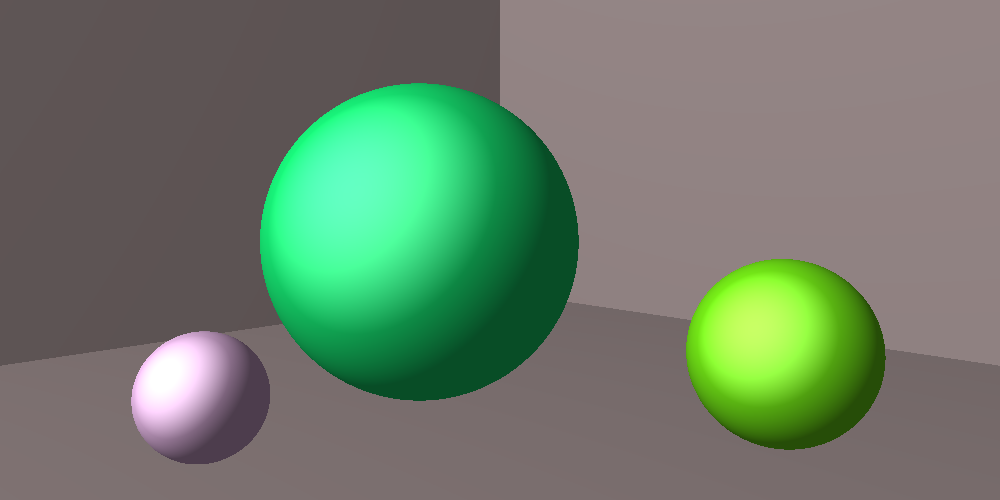

# Ray Tracer
Author: Josiah Kitchin, Computer Science Student at the University of Oregon

A simple 3D ray tracer inspired by *A Ray Tracer Challenge* by James Buck. This project is a work in progress, aiming to build a basic 3D renderer using ray tracing techniques.


(12/27/2024)



## Features
- Ray tracing-based 3D rendering
- Test-driven development with Google Test
- Built with CMake for easy build configuration

## Dependencies 

- Google Test 


## Build 
1. Install cmake
```bash
    sudo apt install cmake
```

2. Clone this repo
 ```bash
    git clone https://github.com/Josiah-Kitchin/Ray-Tracer-Challenge
```

3. Navigate into the repo 
```bash
    cd Ray-Tracer-Challenge
``` 

4. Create a build directory with cmake
```bash
    cmake -S . -B build
```

5. Run the program and output to a ppm file
```bash
    ./ray > image.ppm
```

## Test Build
1. Change directory to the tests directory
```bash
    cd Ray-Tracer-Challenge/tests
```

2. Clone google test 
```bash
    git clone https://github.com/google/googletest.git
```

3. Create the build with cmake 
```bash
    cmake -S . -B build
```


