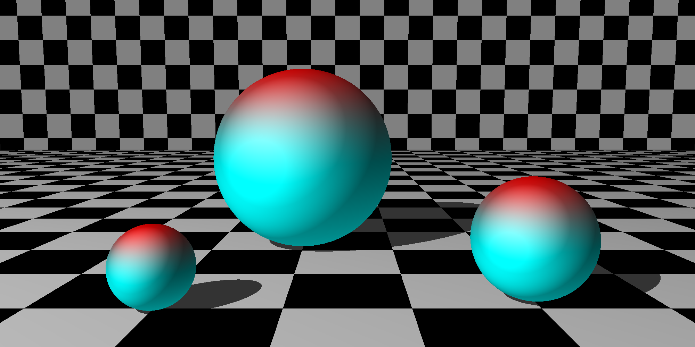

# Ray Tracer
Author: Josiah Kitchin, Computer Science Student at the University of Oregon

A 3D ray tracer inspired by *[The Ray Tracer Challenge](https://www.oreilly.com/library/view/the-ray-tracer/9781680506778/)* by Jamis Buck. This project is a work in progress, aiming to build a 3D renderer using ray tracing techniques.


2000 x 1000, 2.8 seconds to render 



## Features
- Ray tracing-based 3D rendering
- Multithreaded 
- Test-driven development with Google Test
- Built with CMake for easy build configuration

## Dependencies 

- Google Test 
- SFML for the application 
- TBB for multithreading 


## Build 
```bash
    git clone https://github.com/Josiah-Kitchin/Ray-Tracer #clone the repo 
    cd Ray-Tracer 
    bash setup.sh # installs dependencies and builds engine and application
```

## Run Application 
```bash
    cd application
    cd build
    ./ray
```

## Test Build
```bash
    cd Ray-Tracer/tests
    git clone https://github.com/google/googletest.git
    cmake -S . -B build #create the make files with cmake 
    cd build
    make #compile the code to create an executable 
    ./ray_test #run the tests 
```

## Example main.cpp
[Main](application/src/main.cpp)


See [Docs](docs) for more information on how to use the ray tracer


